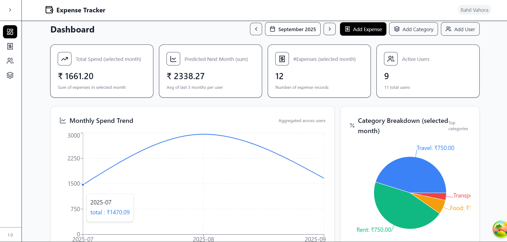
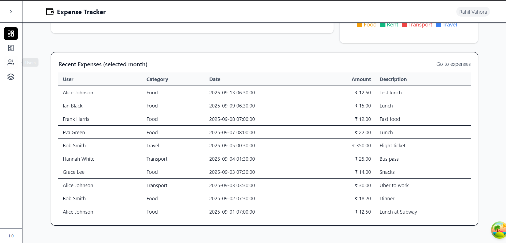
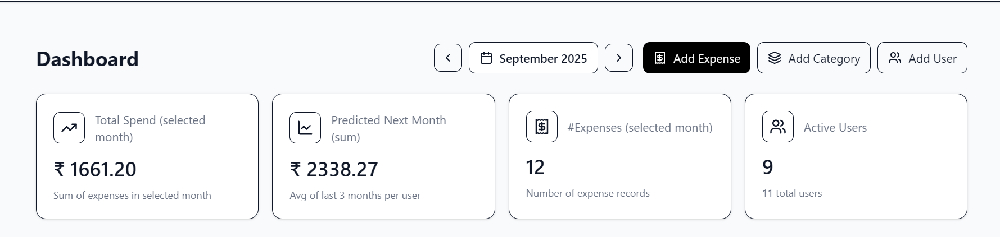
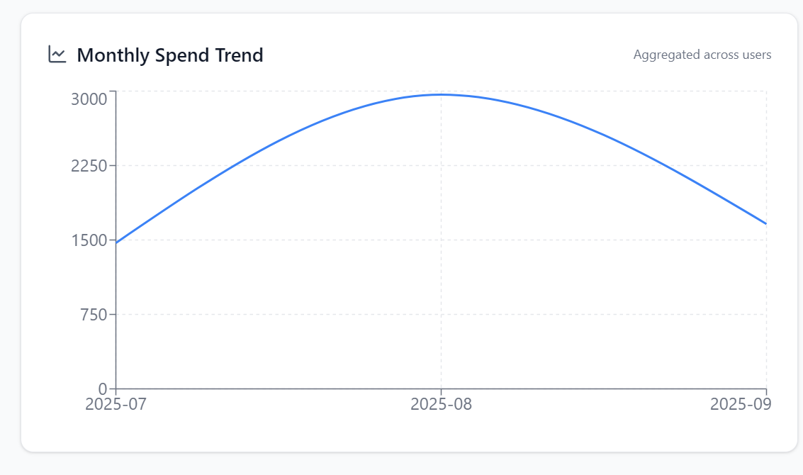
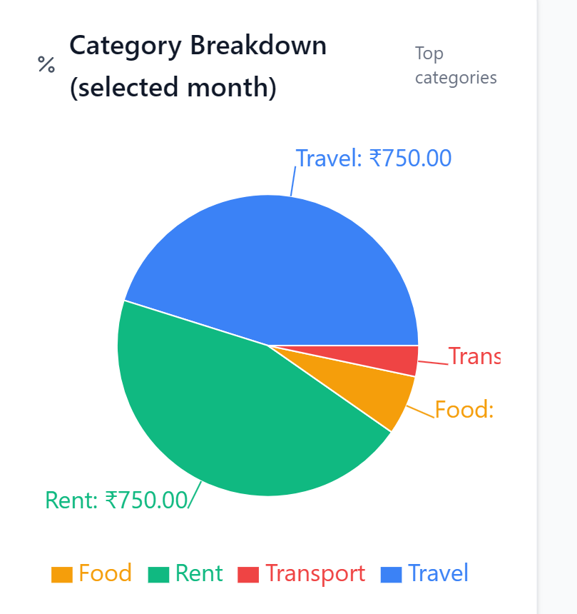
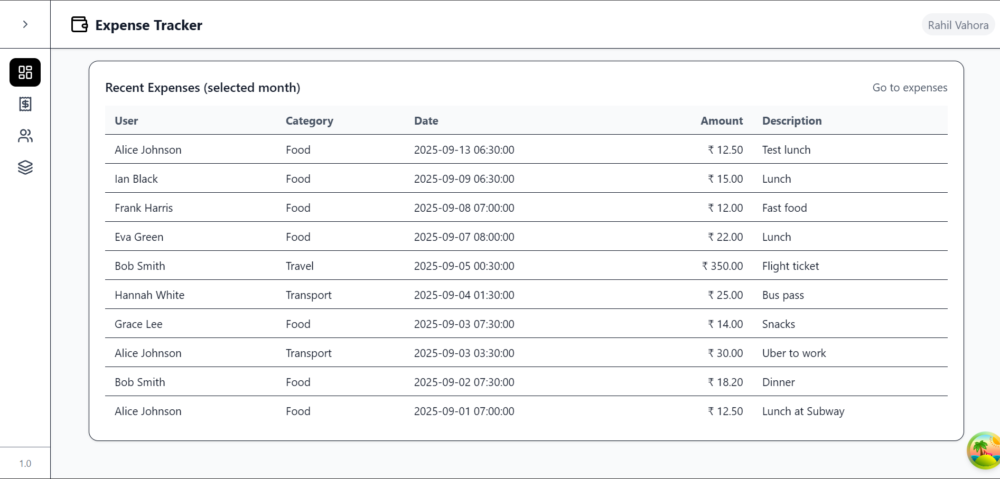
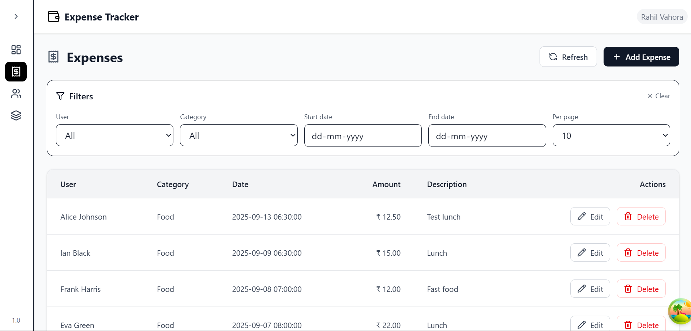
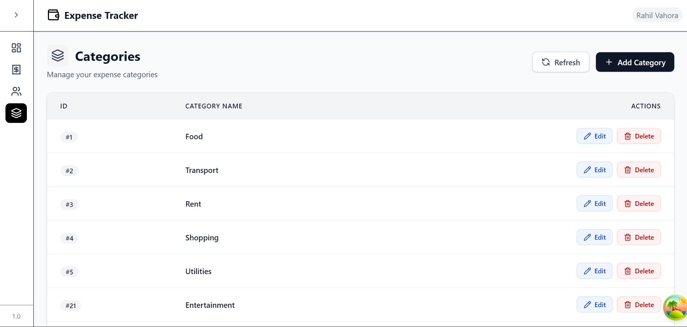
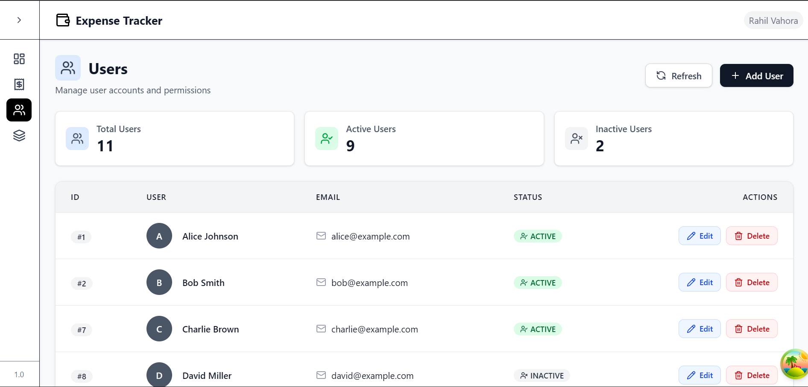

# 📊 Expense Tracker

# [Live Link](https://expense-tracker-rahil1202.vercel.app)

Full-stack **Expense Tracker** web app built with:

* **Frontend**: React + Vite + TailwindCSS + TanStack Query + lucide-react
* **Backend**: Node.js + Express + MySQL
* **Database**: MySQL schema with 3 tables (`users`, `categories`, `expenses`)

Features:

* Add / update / delete **Users, Categories, Expenses**
* Filter expenses by **user, category, date range**
* Statistics APIs:
  * Top 3 spend days per user
  * Monthly % change per user
  * Next month prediction (avg of last 3 months)
* Dashboard with KPIs, charts, recent expenses, and quick-add modals

Repo: [github.com/rahil1202/expense-tracker](https://github.com/rahil1202/expense-tracker)

---

## 🚀 Tech Stack

* **Backend**: Node.js, Express, MySQL, dotenv, zod, helmet, compression, rate-limiting
* **Frontend**: React (Vite), TailwindCSS, TanStack Query, Axios, lucide-react, Recharts
* **Database**: MySQL (schema + seed scripts)

---

## 🖼 Screenshots

### Dashboard Overview




### Stats — KPI Cards



### Stats — Monthly Trend Chart



### Stats — Category Breakdown Pie



### Stats — Recent Expenses Table



### Expenses Management



### Categories Management



### Users Management



---

## 🗄 Database Setup

### 1) Install MySQL on Windows

* **Option A: MySQL Installer**

  1. Download from [MySQL Community Downloads](https://dev.mysql.com/downloads/installer/).
  2. Run the installer, choose **Server Only** or **Developer Default**.
  3. Configure root password (save it, add to `.env`).
  4. Ensure MySQL runs as a Windows service.
  5. Test:

     ```bash
     mysql -u root -p
     ```

---

### 2) Configure `.env`

```env
DB_HOST=localhost
DB_PORT=3306
DB_USER=root
DB_PASSWORD=yourpassword
DB_NAME=expense_tracker
PORT=8080
```

### 3) Run schema + seed

```bash
cd backend
npm run db:schema
npm run db:seed
```

---

## 🛠 Backend Setup

```bash
cd backend
npm install
npm run dev   # http://localhost:8080
```

---

## 🎨 Frontend Setup

```bash
cd frontend
npm install
npm run dev   # http://localhost:5173
```

`frontend/.env`

```env
VITE_API_BASE_URL=http://localhost:8080/api/v1
```

---

## 📂 Project Structure

```
backend/
  src/
    config/
    controllers/
    routes/
    middleware/
    utils/
    db/          # schema.sql, seed.sql, mysql.config.js
  index.js

frontend/
  src/
    features/    # users, categories, expenses, dashboard
    components/
    pages/
    layout/
    routes/
    lib/
```

---

## 📜 License

MIT © 2025 [Rahil Vahora](https://github.com/rahil1202)


